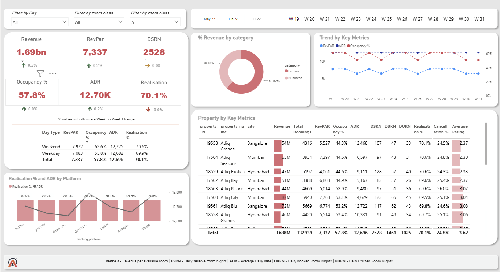

# 🏨 Hotel Revenue Insights Dashboard (Power BI)

This is an interactive **Power BI dashboard** project focused on analyzing hotel revenue and business performance in the hospitality industry. The dataset includes hotel bookings, room details, and key performance indicators (KPIs) such as **RevPAR, ADR, Occupancy Rate, Realisation %, and Revenue** to provide meaningful business insights.

---

## 📊 Project Objective

The objective of this project is to analyze hotel revenue trends and operational performance using a clean, interactive Power BI dashboard. This project demonstrates:

- Data cleaning and transformation using **Power Query**
- Creating relationships between multiple tables using a data model
- Building **DAX measures** for business KPIs
- Interactive dashboard design with slicers and filters
- Business storytelling through data visualization

---

## 📂 Project Files

- **Hotel Revenue Insights Dashboard.pbix** — Power BI dashboard file
- **CSV Files** — Source datasets used in the project
- **dashboard.png** — Dashboard preview image

---

## 📷 Dashboard Preview

---

## 🛠️ Tools Used

- Microsoft Power BI Desktop
- Power Query (ETL)
- DAX (Data Analysis Expressions)
- Data Modeling
- Microsoft Excel (Dataset Preparation)

---

## 📈 Key KPIs

- Revenue
- RevPAR (Revenue Per Available Room)
- ADR (Average Daily Rate)
- Occupancy Rate
- Realisation %
- Booking Trends
- Revenue by City
- Revenue by Room Class
- Revenue by Booking Platform

---

## 💡 Key Insights

- Identified high-performing cities based on revenue generation.
- Compared occupancy rates across different hotel categories.
- Analyzed booking trends by platform and room class.
- Monitored ADR and RevPAR to evaluate hotel performance.
- Built an interactive dashboard to support data-driven business decisions.

---

## 🚀 Skills Demonstrated

- Data Cleaning
- Data Transformation
- Data Modeling
- DAX Calculations
- KPI Dashboard Development
- Business Intelligence
- Data Visualization
- Analytical Thinking

---

## 👩‍💻 Created By

**Nikita Chakraborty**

Chemical Engineering Undergraduate | MANIT Bhopal

Aspiring Data Analyst | SQL | Power BI  | Excel
